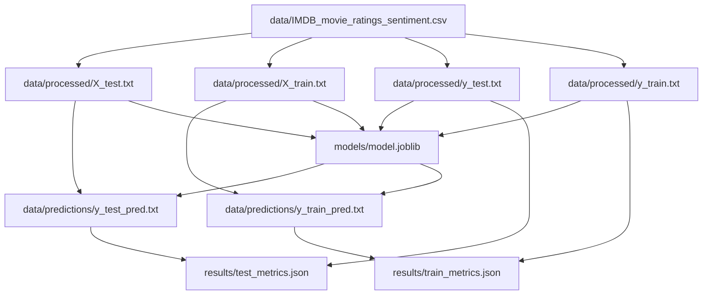

# Open Source MLOPS with DVC and CML

## A note on virtual environments

Since starting to write the book in early 2022 there have been a lot of changes to the open source depdendencies that this project relies on. In order to ensure that a reproducible environment is available for readers across platforms, I have set up a virtual environment in [poetry](https://python-poetry.org/) which can be used to install the dependencies for this project as an alternative to the way described in the book, which uses `pip`. The get started with poetry, you can follow the instructions [here](https://python-poetry.org/docs/#installing-with-pipx). I recommend installing poetry using `pipx` as described in the link above. Note that this virtual environment contains all the dependencies that you will encounter in the book, so you can safely ignore any instructions to install packages in the code examples in the book.

Once you have poetry installed, you can install the dependencies for this project by running the following command from the root of the project:

```bash
poetry install
```

To create a shell with the virtual environment activated, run the following command:

```bash
poetry shell
```

## Model Metrics

| Path                 | score   |
|----------------------|---------|
| results/metrics.json | 0.891   |

## DAG

This shows the Directed Acyclic Graph (DAG) for the current project pipeline.


