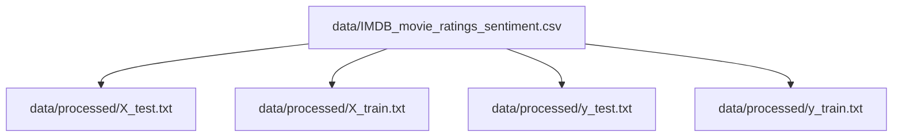

# Open-Source-MLOPs-with-DVC-and-CML

## DAG

```mermaid
flowchart TD
	node1["data/IMDB_movie_ratings_sentiment.csv"]
	node2["data/processed/X_test.txt"]
	node3["data/processed/X_train.txt"]
	node4["data/processed/y_test.txt"]
	node5["data/processed/y_train.txt"]
	node1-->node2
	node1-->node3
	node1-->node4
	node1-->node5
```
