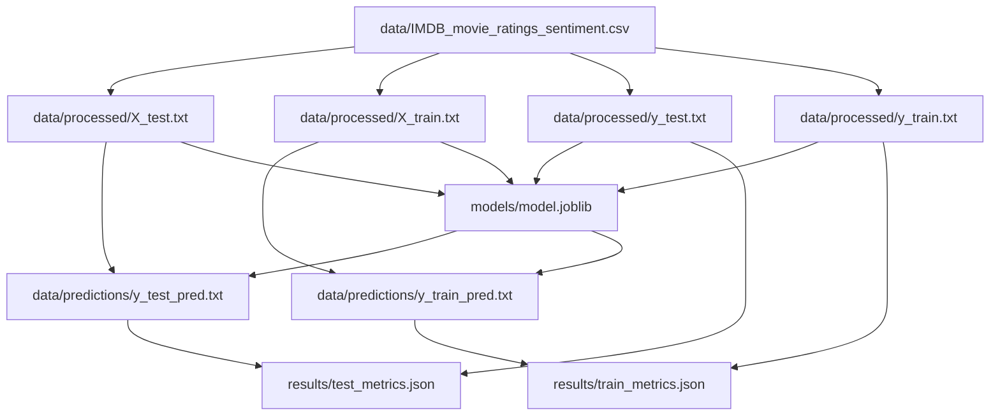

# Open-Source-MLOPs-with-DVC-and-CML

## Model Metrics

| Path                 | score   |
|----------------------|---------|
| results/metrics.json | 0.891   |

## DAG

```mermaid
flowchart TD
	node1["data/IMDB_movie_ratings_sentiment.csv"]
	node2["data/predictions/y_test_pred.txt"]
	node3["data/predictions/y_train_pred.txt"]
	node4["data/processed/X_test.txt"]
	node5["data/processed/X_train.txt"]
	node6["data/processed/y_test.txt"]
	node7["data/processed/y_train.txt"]
	node8["models/model.joblib"]
	node9["results/test_metrics.json"]
	node10["results/train_metrics.json"]
	node1-->node4
	node1-->node5
	node1-->node6
	node1-->node7
	node2-->node9
	node3-->node10
	node4-->node2
	node4-->node8
	node5-->node3
	node5-->node8
	node6-->node8
	node6-->node9
	node7-->node8
	node7-->node10
	node8-->node2
	node8-->node3
```
